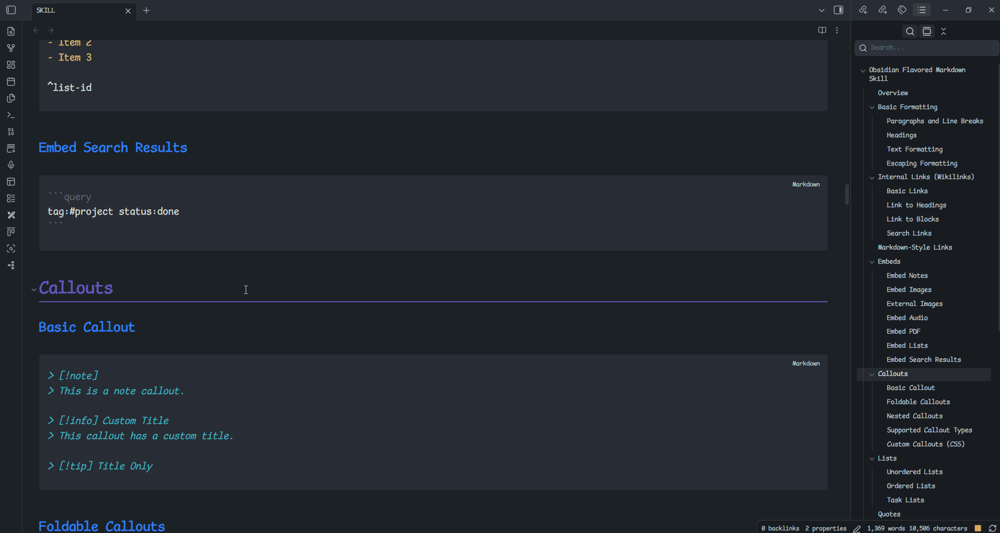
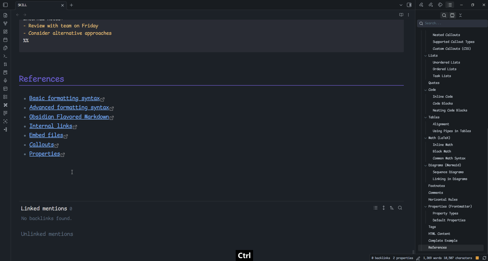
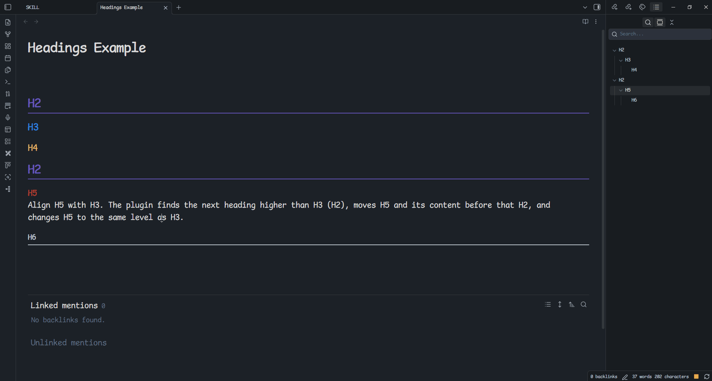
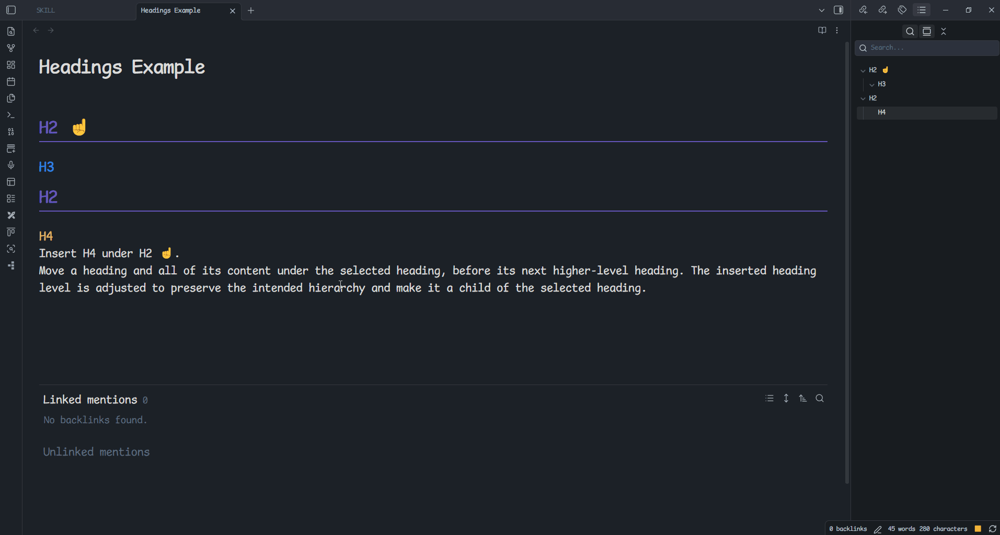
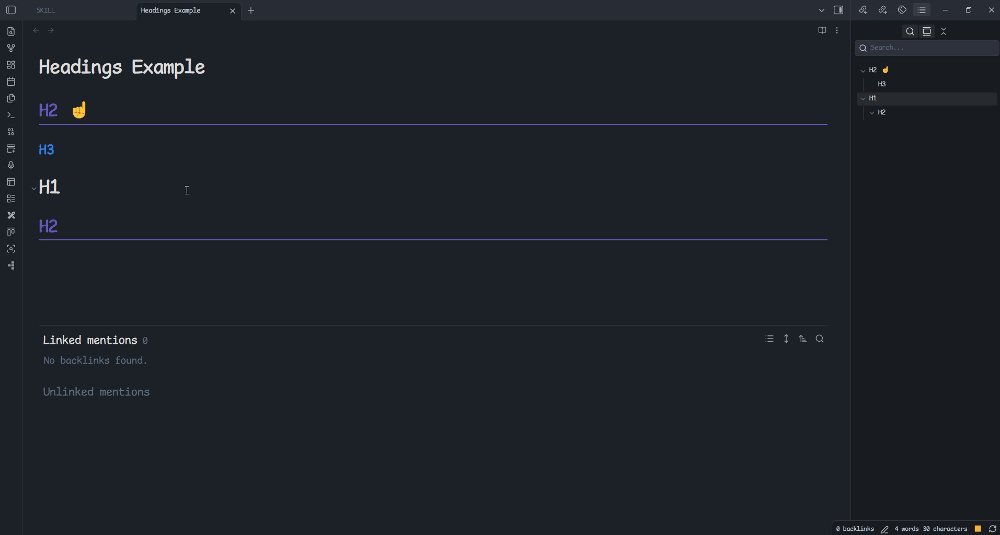
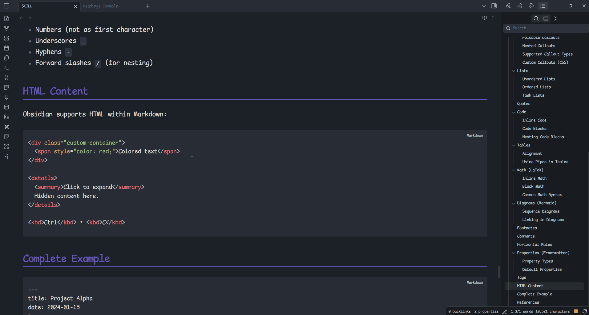

# Headings

[English](README.md) | [繁體中文](README.zh-TW.md) | [简体中文](README.zh-CN.md) | [日本語](README.ja.md) | [한국어](README.ko.md) | [Español](README.es.md) | [Français](README.fr.md)

Organize the outline and sections of your Obsidian Markdown notes quickly. This plugin lets you navigate, copy, select, move, insert, and align headings. It is useful when restructuring long notes, reordering sections, or maintaining a consistent heading hierarchy.


[](https://ko-fi.com/B0B37J4BG)

## Commands

### Go to heading
Browse all headings in the current note and move the cursor to the selected heading.




### Copy heading
Browse all headings in the current note. After selecting one, you can copy the heading or insert its heading marker at the current cursor position.



### Align heading level
Move a heading and all of its content to the position after the selected heading and before the next higher-level heading. The moved heading level is changed to match the selected heading, and its descendants are adjusted by the same amount.

> [!important]
> The heading hierarchy is changed to align the heading level.

Example: 
Align H5 with H3. The plugin finds the next heading higher than H3 (H2), moves H5 and its content before that H2, and changes H5 to the same level as H3.

Before:
```markdown
## H2
### H3
#### H4
## H2
##### H5
###### H6
```

After:
```markdown
## H2
### H3
#### H4
### H5
#### H6
## H2
```



> [!caution]
> Obsidian supports heading levels 1 through 6 only. When an adjustment would exceed level 6, the heading is displayed at level 6.

Example: align H3 ✌️ with H4.

Before:
```markdown
## H2
### H3
#### H4
##### H5
## H2
### H3 ✌️
#### H4 ✌️
##### H5 ✌️
###### H6 ✌️
```

After:
```markdown
## H2
### H3
#### H4
##### H5
#### H3 ✌️
##### H4 ✌️
###### H5 ✌️
###### H6 ✌️
## H2
```


### Insert heading under another heading
Move a heading and all of its content under the selected heading, before its next higher-level heading. The inserted heading level is adjusted to preserve the intended hierarchy and make it a child of the selected heading.

> [!important]
> You cannot insert a heading under one of its own descendants or under its current parent, because it already belongs there.

> [!important]
> Whenever there is a level difference between the moved heading and the target heading, the moved heading level is adjusted to preserve a valid hierarchy.

Example: 
Insert H4 under H2 ☝️.

Before:
```markdown
## H2 ☝️
### H3
## H2
#### H4
```

Without adjusting its level, H4 would become a child of H3 rather than a direct child of H2 ☝️:

```markdown
## H2 ☝️
### H3
#### H4 ❌
## H2
```

To preserve the intended structure, H4 is changed to level 3:

```markdown
## H2 ☝️
### H3
### H4 ⭕
## H2
```



> [!caution]
> Obsidian supports heading levels 1 through 6 only. When an adjustment would exceed level 6, the heading is displayed at level 6.

Example: 
Insert H3 ✌️ under H4.

Before:
```markdown
## H2
### H3
#### H4
##### H5
## H2
### H3 ✌️
#### H4 ✌️
##### H5 ✌️
###### H6 ✌️
```

After:
```markdown
## H2
### H3
#### H4
##### H5
##### H3 ✌️
###### H4 ✌️
###### H5 ✌️
###### H6 ✌️
## H2
```

### Move heading
Move the selected heading and all of its content to the position after another selected heading and before that heading's next  section. This command does not change heading levels.

> [!important]
> This command changes only the position of the heading and its content. It keeps the original heading hierarchy.

Example: 
Moving H1 to H2 ☝️, 
the plugin finds the next heading(H3) from H2 ☝️, and moves H1 and its content before H3 without changing their levels.

Before:
```markdown
## H2 ☝️
### H3
# H1
## H2
```

After:
```markdown
## H2 ☝️
# H1
## H2
### H3
```




### Move current block under heading
Move the block containing the current cursor position under the selected heading.



### Move selected text under heading
Move the selected text under the selected heading.


### Select heading content
Select all content under the selected heading.


## References

### [Heading Shifter](https://github.com/k4a-l/obsidian-heading-shifter)
Heading Shifter already provides several useful heading features. This plugin avoids duplicating those features unless necessary; install Heading Shifter when you need its corresponding functionality.