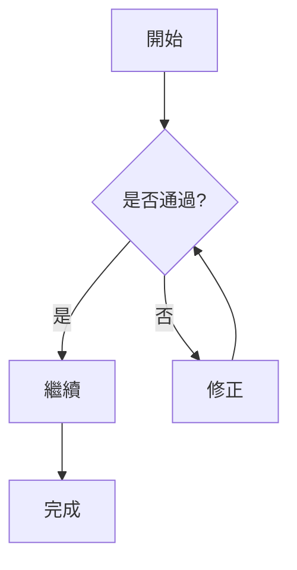
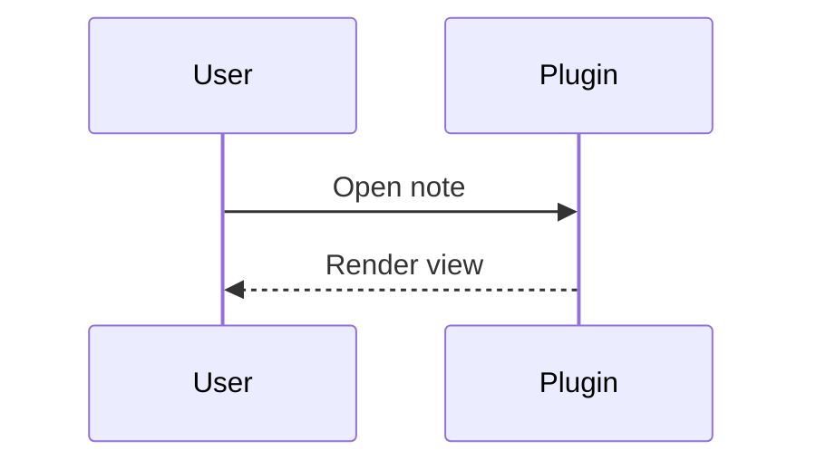

# Obsidian Markdown 語法總覽

這份文件示範 Obsidian 常用與進階語法。

---

## 1. 文字格式

一般文字、**粗體**、*斜體*、***粗斜體***、~~刪除線~~、==高亮==、`inline code`。

跳脫字元示範：\*不是斜體\*、\#不是標題、1\. 不是清單。

段落換行示範：這是第一行。  
這是同段落的下一行（行尾兩個空白）。

---

## 2. 標題層級

# H1
## H2
### H3
#### H4
##### H5
###### H6

---

## 3. 連結（Wikilink / Markdown Link）

- 基本 wikilink: [[Another Note]]
- 顯示文字: [[Another Note|自訂顯示名稱]]
- 指向標題: [[Another Note#Section A]]
- 同檔標題: [[#4. 清單]]
- 依關鍵字搜尋標題: [[##syntax]]
- 依關鍵字搜尋區塊: [[^^demo]]

Markdown 連結：

- [Obsidian 官方網站](https://obsidian.md)
- [Vault 內檔案（URL encoded）](Another%20Note.md)
- [Obsidian URI](obsidian://open?vault=MyVault&file=Another%20Note.md)

---

## 4. 清單

無序清單：

- 項目 A
- 項目 B
  - 子項目 B-1
  - 子項目 B-2
- 項目 C

有序清單：

1. 步驟一
2. 步驟二
   1. 子步驟 2-1
   2. 子步驟 2-2
3. 步驟三

待辦清單：

- [ ] 未完成任務
- [x] 已完成任務
- [ ] 多層任務
  - [ ] 子任務 1
  - [x] 子任務 2

---

## 5. 引用與水平線

> 這是引用。
> 同一個引用可多行。
>
> > 這是巢狀引用。

---

## 6. Callout

> [!note]
> 這是 note callout。

> [!tip] 自訂標題
> 這是 tip callout。

> [!warning]- 預設收合
> 點開才會看到內容。

> [!question]+ 預設展開
> 可以手動收合。

> [!example] 巢狀 callout
> > [!info]
> > 這是內層 callout。

---

## 7. 程式碼

Inline code：`const x = 1;`

```ts
function greet(name: string): string {
  return `Hello, ${name}`;
}
```

````markdown
```python
print("nested code block demo")
```
````

---

## 8. 表格

| 欄位 | 類型 | 說明 |
|:-----|:----:|-----:|
| name | text | 使用者名稱 |
| age  | num  | 年齡 |
| vip  | bool | 是否 VIP |

表格中有管線符號需跳脫：

| 範例 | 值 |
|------|----|
| link | [[Another Note\|顯示文字]] |
| embed | ![[image.png\|120]] |

---

## 9. 數學公式（LaTeX）

行內公式：$e^{i\pi} + 1 = 0$。

區塊公式：

$$
\frac{d}{dx}(x^2) = 2x
$$

矩陣：

$$
\begin{bmatrix}
a & b \\
c & d
\end{bmatrix}
$$

---

## 10. Mermaid 圖





---

## 11. 嵌入（Embeds）

- 嵌入整篇筆記：![[Another Note]]
- 嵌入指定標題：![[Another Note#Section A]]
- 嵌入區塊：![[Another Note#^block-demo]]
- 圖片嵌入：![[image.png]]
- 指定寬度：![[image.png|300]]
- 指定寬高：![[image.png|640x360]]
- PDF 指定頁：![[sample.pdf#page=2]]
- PDF 指定高度：![[sample.pdf#height=400]]
- 音訊嵌入：![[demo.mp3]]

外部圖片：


---

## 12. 區塊連結（Block ID）

這段文字有 block id，可被連結或嵌入。 ^block-demo

- 連結到本段：[[#^block-demo]]
- 嵌入本段：![[#^block-demo]]

清單也可有 block id：

- 項目一
- 項目二

^list-demo

嵌入清單：![[#^list-demo]]

---

## 13. 腳註（Footnotes）

這句話有腳註[^1]，也有命名腳註[^obsidian]。

Inline footnote 也可用。^[這是 inline footnote。]

[^1]: 這是數字腳註內容。
[^obsidian]: 這是命名腳註內容。

---

## 14. 註解（Comments）

這段可見，%%中間這段隱藏%%，閱讀模式不顯示。

%%
這是多行隱藏註解。
通常用於草稿、內部備註。
%%

---

## 15. 標籤（Tags）

內文標籤：#demo #obsidian/syntax #tag-with-dash #tag_with_underscore

---

## 16. HTML 內嵌

<div style="padding:8px;border:1px solid #999;border-radius:6px;">
  這是 HTML 區塊。
</div>

<details>
  <summary>點我展開</summary>
  這是 details / summary 內容。
</details>

快捷鍵示範：<kbd>Ctrl</kbd> + <kbd>P</kbd>

---

## 17. 查詢區塊（Query）

```query
tag:#demo
```

---

## 18. 參考範例（屬性與連結）

- 這份筆記有 frontmatter 屬性。
- 可在 Properties 面板直接編輯。
- 建議搭配 Dataview 或 Bases 做進階查詢。
